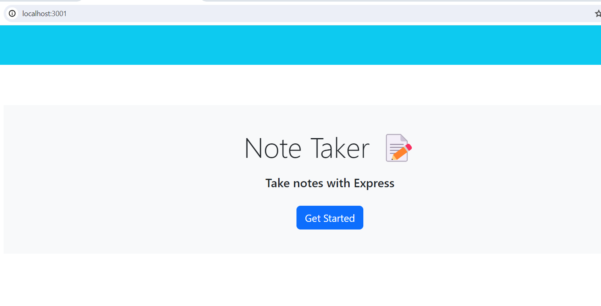
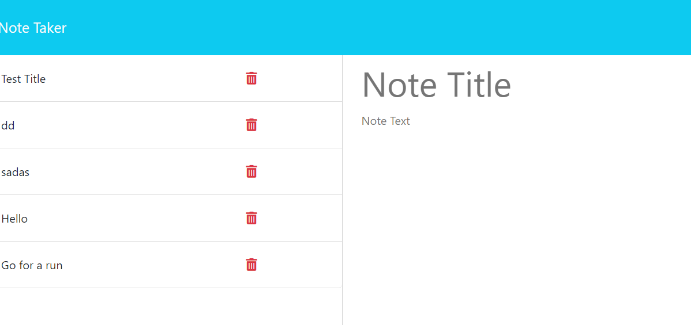
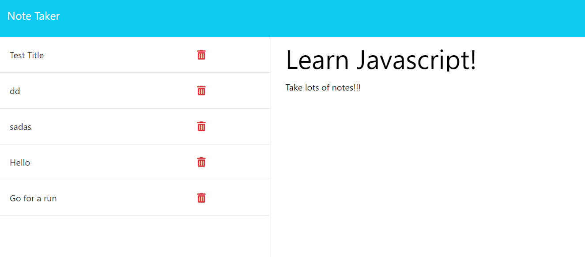
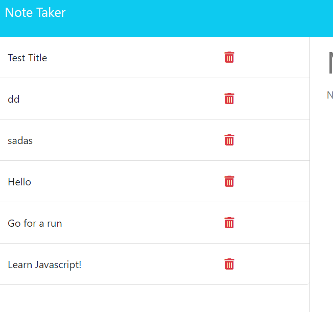

# Note Taker Express
  '

  ## Description

    To create an application called Note Taker that can be used to write and save notes. This application will use an Express.js back end and will save and retrieve note data from a JSON file.

  ## Table of Content 
- [Note Taker Express](#note-taker-express)
  - [Description](#description)
  - [Table of Content](#table-of-content)
  - [Installation](#installation)
  - [Usage](#usage)
  - [License](#license)
  - [Links](#links)
  - [Github](#github)
  
## Installation
Node js
Express package

## Usage 
To make a page that helps you take note for the day. Here are the examples. 

## License
  
Read about your license MIT

 ## Links 
Deployed page: https://kaidoll.github.io/NoteTakerExpress/
Heroku link: https://notetakerexpresss-673156861e98.herokuapp.com/  

 ## Github 
Username: KaiDoll
